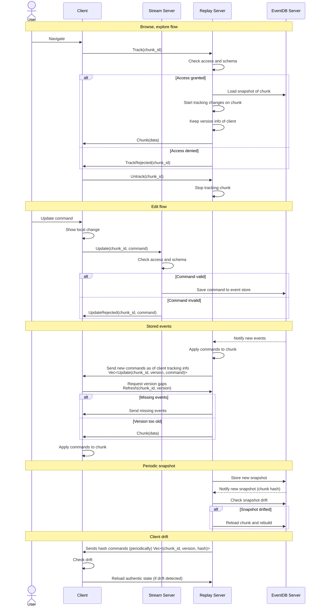

# Cooperative edit.

Cooperative as server is not keeping a strict control over the client. Clients can do anything; as long as the
replay works everyone is happy. Client may drift however they want to and the server only helps them to keep in sync with the
latest authentic version. It is up to the client to respect it or not, but events from a drifted client will be ignored more often.

## Client load

1. Client loads (tracks) chunk based on some (external) logic.
2. Send load/track request to the Replay server. (`Track(chunk_id)`)

## Client update

1. Apply an update command locally marked as uncommitted.
   - Local changes will be display in a different way so client may know it is still pending.
   - Once the retention of this local sate has expired blend the result into the current authentic version.
2. Send command to the `Stream server` (`Update(chunk_id, command)`)

## Client receive:

1. **Replay server** rejects the load request (`TrackRejected(chunk_id)`)
    - discard the chunk
    - Root cause: expired session, bogus or malicious client
2. **Stream server** rejects the command (`UpdateRejected(chunk_id, command)`)
    - discard the local changes 
    - Root cause: expired session, bogus or malicious client
3. **Replay server** sends a snapshot (`Chunk(data)`)
    - Sore chunk (unless already stored)
4. **Replay server** sends committed commands (`Vec<Update(chunk_id, version(!), command>)>`)
    - finalize or discard the local changes
    - If some version are missing and ther is a version gap, request an update (`Refresh(chunk_id, version)`)
5. **Replay server** sends chunk hash commands (`Vec<(chunk_id, version, hash>)`), 
    - check drift and reload an authentic state from the server as if it were a fresh load (**Client load**)
    - Apply the retention policy of the local changes

## Stream server (very lightweight)

1. Server receives command from client (`Update(chunk_id, command)`)
2. Server validates the command schema and the access to the chunk. This is just a schema validation but does not consider
if command can be applied. The semantic is handled by each parties independently (but using the same code base)
3. Send immediate rejection to the client if there is an error (`UpdateRejected(chunk_id, command)`)
4. Server saves the command to the event store
Note: Commands are stored in an event stream where each commands are ordered on the server using version numbers. During playback this fixed ordering is used, whichever command arrived first will be used resulting in a last writer wins. If commands cannot be applied, it is discarded. Command may contain pre-requests like an assumed value thus clients may have better control how should the command be handled.

## Replay server:

1. Receive chunk to track from the client (`Track(chunk_id)`)
    a. Check access and reject if required (`TrackRejected(chunk_id)`)
    a. Start listening to events of the given chunk (if new)
    b. Load snapshot of the chunk (if new)
    c. Send the snapshot to the client (`Chunk(data)`)
    d. Start tracking the versions of the client
2. Receive a refresh from a client (`Refresh(chunk_id, version)`)
   a. Send events missing on the client based on the in-memory event queue
   b. If client version is too old, send a full state (`Chunk(data)`) optionally
3. Receive there are new snapshot in the DB
    a. Keep last n snapshot hashes in memory (hash is part of the DB notification)
    a. Check if the snapshot is drifted by comparing the hash
    b. If the snapshot is drifted, reload the chunk from DB and rebuild the chunk from the last authentic snapshot
4. Receive there are new events in the DB
    a. Keep last n commands in memory
    b. Load missing event
    b. Apply the commands to the chunk. Check the command consistency (as any other party using the shared code) and discard them.
    This playback will be a candidate for the next authentic state. If commands have to be discarded from a clients we could flag the client, but it should not break the system due to the assumed cooperative nature.
    c. Using some heuristics (after every n command or time), store a new snapshot. If another snapshot was created meanwhile, check the hash and reload as required.
    d. Send the new events to the clients based on the tracked client versions (assume reliable communication) (`Vec<Update(chunk_id, version(!), command>)>`)
5. Periodically for some chunks send the authentic version to some clients (`Vec<(chunk_id, version, hash>)`)

## TODO:
Some idea about retention policy of the local state/change:
 - Keep the local change alive for n new commands (version increment)
 - Keep the local change alive for n seconds
 - Check the committed command for the local command (ex using hash on the command). This fails when a full state (snapshot) is received 
   instead of commands.

# Figures

