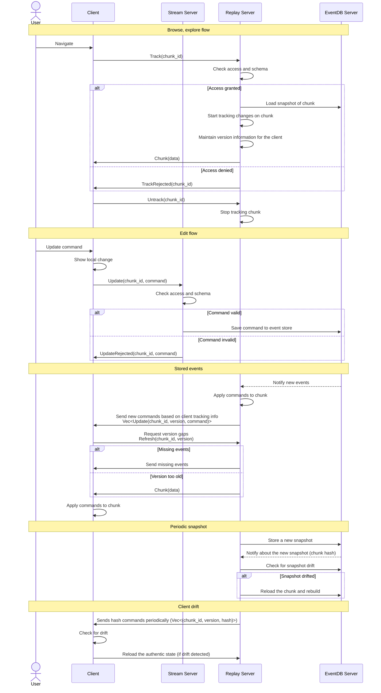

# Cooperative Edit

The cooperative server does not strictly control the client. Clients can perform any actions as long as the replay functions correctly and all 
participants are satisfied. Clients may drift as they wish, while the server assists in synchronizing them with the latest authentic version. Clients 
are responsible for respecting this synchronization; however, events from a drifted client are often ignored.

## High-Level Overview

### Client Load

1. The client loads (or tracks) a chunk based on external logic.
2. The client sends a load/track request to the Replay server (`Track(chunk_id)`).

### Client Update

1. The client applies an update command locally and marks it as uncommitted.
   - Local changes are displayed differently to indicate that they are still pending.
   - After the retention period for the local state expires, the result is merged into the current authentic version.
2. The client sends the command to the `Stream server` (`Update(chunk_id, command)`).

### Client Receive

1. **Replay server** rejects the load request (`TrackRejected(chunk_id)`):
    - The client discards the chunk.
    - Possible root causes include an expired session, a bogus request, or a malicious client.
2. **Stream server** rejects the command (`UpdateRejected(chunk_id, command)`):
    - The client discards the local changes.
    - Possible root causes include an expired session, a bogus request, or a malicious client.
3. **Replay server** sends a snapshot (`Chunk(data)`):
    - The client stores the chunk unless it is already stored.
4. **Replay server** sends committed commands (`Vec<Update(chunk_id, version(!), command)>`):
    - The client finalizes or discards the local changes.
    - If some versions are missing and there is a version gap, the client requests an update (`Refresh(chunk_id, version)`).
5. **Replay server** sends chunk hash commands (`Vec<(chunk_id, version, hash)>`):
    - The client checks for drift and reloads the authentic state from the server as if performing a fresh load (**Client Load**).
    - The client applies the retention policy to the local changes.

### Stream Server (Very Lightweight)

1. The server receives a command from the client (`Update(chunk_id, command)`).
2. The server validates the command schema and access to the chunk. This validation only checks the schema and does not determine whether the
command can be applied. The semantics are handled independently by each party, though they use the same code base.
3. The server sends an immediate rejection to the client if there is an error (`UpdateRejected(chunk_id, command)`).
4. The server saves the command to the event store.

**Note**: Commands are stored in an event stream where each command is ordered on the server using version numbers. During playback, this fixed
ordering is used, resulting in a "last writer wins" scenario. If commands cannot be applied, they are discarded. Commands may include prerequisites,
such as an assumed value, which provide clients with better control over how the command is handled. (For example, set the value to 2
if the current value is 1.)

### Replay Server

1. Receive a chunk to track from the client (`Track(chunk_id)`):
    a. Check access and reject if required (`TrackRejected(chunk_id)`).
    b. Begin listening to events for the specified chunk, if it is new.
    c. Load a snapshot of the chunk, if it is new.
    d. Send the snapshot to the client (`Chunk(data)`).
    e. Start tracking the versions of the client.
2. Receive a refresh from a client (`Refresh(chunk_id, version)`):
    a. Send events missing on the client, as determined by the in-memory event queue.
    b. If the client version is too old, optionally send a full state (`Chunk(data)`).
3. Receive new snapshots in the database:
    a. Store the last `n` snapshot hashes in memory (the hash is part of the database notification).
    b. Check if the snapshot has drifted by comparing the hash.
    c. If the snapshot has drifted, reload the chunk from the database and rebuild the chunk from the last authentic snapshot.
4. Receive new events in the database:
    a. Keep the last `n` commands in memory.
    b. Load missing events.
    c. Apply the commands to the chunk. Verify the command consistency (as any other party using the shared code would) and discard inconsistent commands.
       This playback will be a candidate for the next authentic state. If commands must be discarded from clients, the client could be flagged, but the
       system should not break due to the assumed cooperative nature.
    d. Using heuristics (e.g., after every `n` commands or a specific time interval), store a new snapshot. If another snapshot was created in the meantime,
       check the hash and reload as required.
    e. Send the new events to the clients based on the tracked client versions (assume reliable communication) (`Vec<Update(chunk_id, version(!), command)>`).
5. Periodically, for some chunks, send the authentic version to some clients (`Vec<(chunk_id, version, hash)>`).

### TODO

Some ideas about the retention policy of the local state/change:
 - Retain the local change for `n` new commands (version increment).
 - Retain the local change for `n` seconds.
 - Verify the committed command against the local command (e.g., by using a hash of the command). This fails when a full state (snapshot) is received instead
   of commands.

## Figures

## Bevy Implementation Overview

- **tilemap**: Responsible for managing the loading and unloading of map chunks dynamically.
  It ensures the required root-chunks entities are spawned/despawned.
- **chunk**: Provides functionality for adding and managing layers within the tilemap. It stores the authentic snapshots and is used by both 
  Client and Replay server. For example, GroundLayer, HeightmapLayer, etc.
- **decoration**: Handles the local pending changes. Used only by the clients to override the chunk before sending data for rendering.