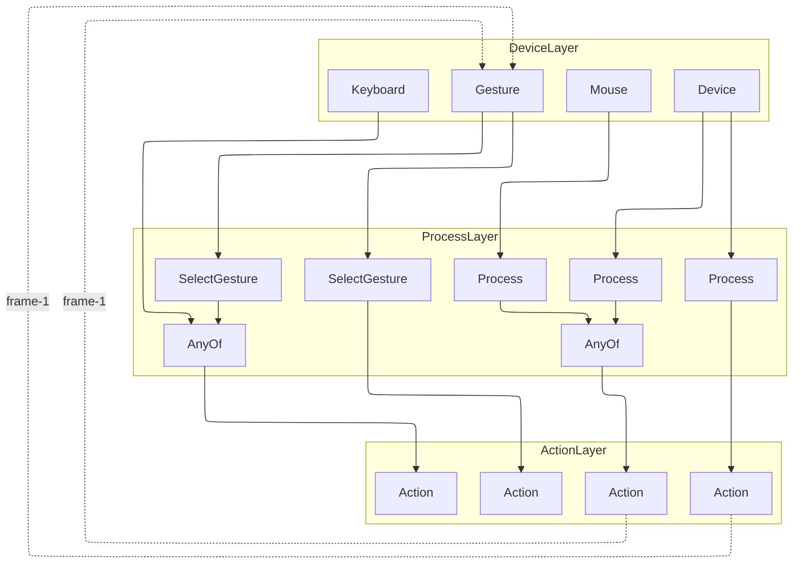

```mermaid
---
config:
  layout: elk
---
flowchart TD;
    subgraph "DeviceLayer"
        Device1["Device"]
        Device2["Mouse"]
        Keyboard
        Gesture
    end
    
    subgraph "ProcessLayer"
        DevProc1["Process"]
        DevProc2["Process"]
        DevProc["Process"]
        AnyOf["AnyOf"]
        AnyOf2["AnyOf"]
           
        SelectGesture1["SelectGesture"]
        SelectGesture2["SelectGesture"]
    end
    
    subgraph "ActionLayer"
        Action1["Action"]
        Action2["Action"]
        Action3["Action"]
        Action4["Action"]
    end

    DeviceLayer ~~~ ProcessLayer
    ProcessLayer ~~~ ActionLayer
    
    Device1-->DevProc1;
    DevProc1-->AnyOf;
    Device2-->DevProc2;
    DevProc2-->AnyOf;
    AnyOf-->Action1;

    Device1-->DevProc;
    DevProc-->Action2;

    Keyboard-->AnyOf2
   
    Action1-.frame-1.->Gesture
    Action2-.frame-1.->Gesture;
    Gesture-->SelectGesture1;
    Gesture-->SelectGesture2;
    SelectGesture1-->AnyOf2;
    AnyOf2-->Action4;
    SelectGesture2-->Action3;

    
```

