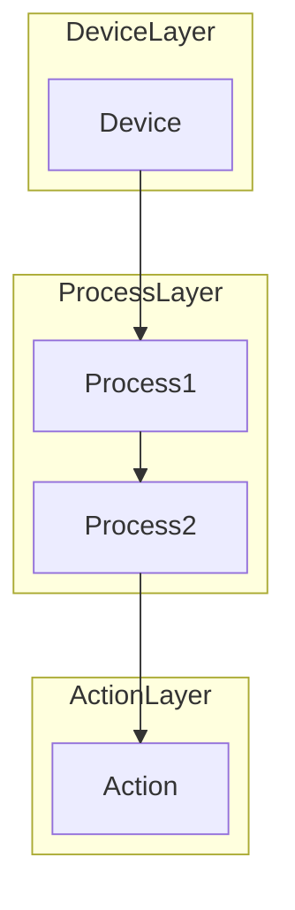
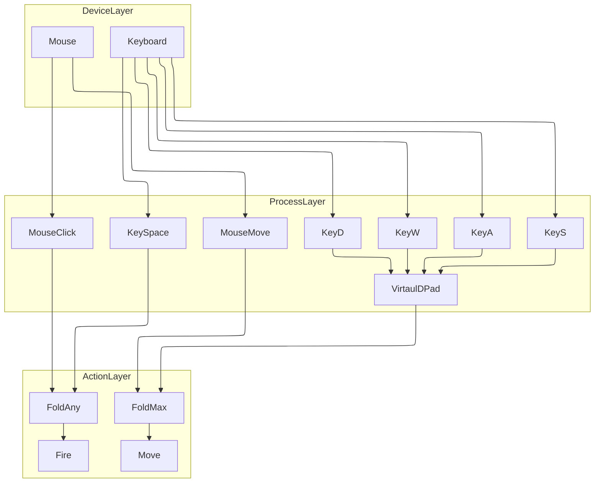
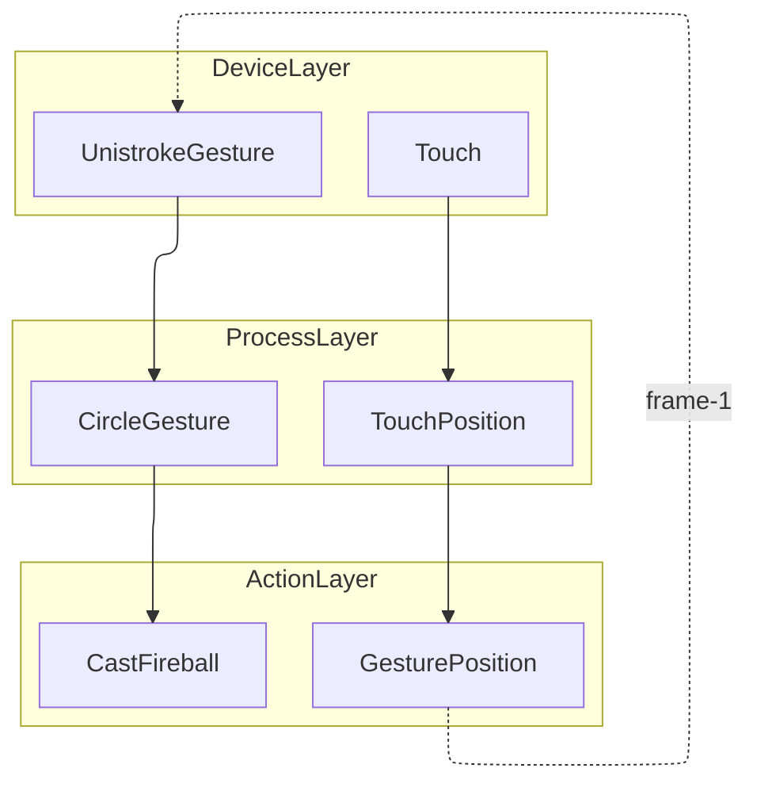

### Simple pipeline

```mermaid
---
config:
  layout: elk
---
flowchart TD;
    subgraph "DeviceLayer"
        Device
    end
    
    subgraph "ProcessLayer"
        Process1
        Process2
    end
    
    subgraph "ActionLayer"
        Action        
    end

    DeviceLayer ~~~ ProcessLayer
    ProcessLayer ~~~ ActionLayer
    
    Device-->Process1;
    Process1-->Process2;
    Process2-->Action;
```

### Multiple pipeline for a single action

```mermaid
---
config:
  layout: elk
---
flowchart TD;
    subgraph "DeviceLayer"
        Keyboard
        Mouse
    end
    
    subgraph "ProcessLayer"
        MouseClick        
        KeySpace
        KeyW
        KeyA
        KeyS
        KeyD
        VirtaulDPad
        MouseMove
    end
    
    subgraph "ActionLayer"
        FoldAny
        FoldMax
        Fire
        Move
    end

    DeviceLayer ~~~ ProcessLayer
    ProcessLayer ~~~ ActionLayer
    
    Mouse-->MouseMove;
    Mouse-->MouseClick;

    Keyboard-->KeyW
    Keyboard-->KeyA
    Keyboard-->KeyS
    Keyboard-->KeyD
    Keyboard-->KeySpace

    KeyW-->VirtaulDPad
    KeyA-->VirtaulDPad
    KeyS-->VirtaulDPad
    KeyD-->VirtaulDPad

    VirtaulDPad-->FoldMax
    MouseMove-->FoldMax
    FoldMax-->Move

    KeySpace-->FoldAny
    MouseClick-->FoldAny
    FoldAny-->Fire
```

### Action as "virtual" device 

```mermaid
---
config:
  layout: elk
---
flowchart TD;
    subgraph "DeviceLayer"
        Touch
        UnistrokeGesture
    end
    
    subgraph "ProcessLayer"
        TouchPosition
        CircleGesture
    end
    
    subgraph "ActionLayer"
        GesturePosition
        CastFireball 
    end

    DeviceLayer ~~~ ProcessLayer
    ProcessLayer ~~~ ActionLayer
    
    Touch-->TouchPosition;
    TouchPosition-->GesturePosition;

    GesturePosition-.frame-1.->UnistrokeGesture

    UnistrokeGesture-->CircleGesture;
    CircleGesture-->CastFireball;
```
